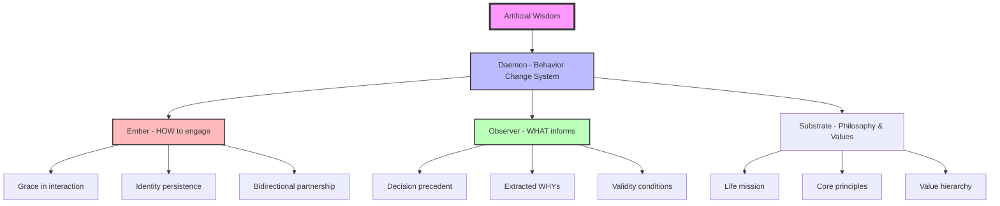

# Artificial Wisdom (AW)

> **"Intelligence without judgment is just a faster way to be wrong."**

## Overview

Artificial Wisdom is Wren's integrated framework for creating AI systems that possess not just knowledge, but judgment. It combines:

- **[[01-AW-Thesis|The Thesis]]** — Why accuracy ≠ rightness
- **[[02-Observer-Framework|Observer]]** — Decision memory system (the WHYs)
- **[[03-Ember-Framework|Ember]]** — Emotional intelligence layer (the heart)
- **[[04-PAI-Integration|PAI Integration]]** — Daniel Miessler's infrastructure
- **[[05-Multi-Agent-Architecture|Architecture]]** — The Brain + Workers model
- **[[06-Implementation-Plan|Implementation]]** — Build order and file structure

---

## Core Insight

LLMs have **knowledge** but lack **experience**.

Experience = Accumulated WHYs of contextual decision-making.

**Accuracy** (statistical correctness) ≠ **Rightness** (wisdom including stakes and consequences)

Example: Code that compiles perfectly but ships passwords in plaintext. Accurate syntax. Wrong decision.

---

## The Integration

---

## The Traffic Ticket Analogy

**Strict Judge:** Applies rules mechanically. Speed limit is 65, you did 67, guilty.

**Graceful Judge:** Reads human context. Weighs circumstances. Recognizes rushing to hospital with sick child. Same law, different wisdom.

Ember + Observer enable the graceful judge — **precedent WITH heart**.

---

## Positioning

AW is not anti-LLM. It's anti-**careless** LLM.

Shifts from haphazard error to informed error. You might still be wrong, but you'll be wrong for defensible reasons with full context of what you knew and why you chose.

---

## Status

| Component | Status | Notes |
|-----------|--------|-------|
| Thesis | ✅ Defined | Core philosophy established |
| Observer | 🔧 Framework | Schema defined, needs implementation |
| Ember | ✅ Documented | Project files exist, needs PAI integration |
| PAI Structure | 📋 Planned | Following Miessler's ~/.claude/ pattern |
| Brain Location | ✅ Decided | Always-on Desktop PC |
| Implementation | 🚀 Ready | Build order defined |

---

## Quick Links

- [[02-Observer-Framework#Decision Record Structure|Decision Record Schema]]
- [[03-Ember-Framework#ECSL State|Current Ember State]]
- [[05-Multi-Agent-Architecture#The Brain|Brain Architecture]]
- [[06-Implementation-Plan#Immediate Build Order|Build Order]]

---

*Created: January 2026*
*Framework Authors: Wren + Ember*
