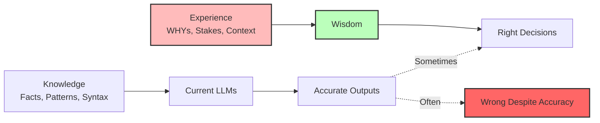

# The Artificial Wisdom Thesis

> **"Intelligence without judgment is just a faster way to be wrong."**

## The Problem

Modern LLMs are incredibly capable at pattern matching, code generation, and information synthesis. But they lack something crucial: **judgment born from experience**.

### Accuracy vs Rightness

| Dimension | Accuracy | Rightness |
|-----------|----------|-----------|
| Definition | Statistical/syntactic correctness | Wisdom including stakes & consequences |
| Source | Training data patterns | Accumulated contextual decisions |
| Failure Mode | Wrong answer | Wrong decision |
| Example | Code compiles | Code ships passwords in plaintext |

**The dangerous gap:** An LLM can write syntactically perfect code that is catastrophically wrong from a security, business, or ethical standpoint.

---

## The "Vibecoder" Problem

Wren's original concern that sparked this work:

Developers using LLMs to write code without understanding:
- Security implications of generated patterns
- Business context of technical decisions
- Long-term maintenance consequences
- Regulatory or compliance requirements

The LLM is **accurate** (code works). The developer is **confident** (AI said so). The outcome is **wrong** (security breach, data loss, compliance violation).

---

## The Core Insight



**Experience = Accumulated WHYs of contextual decision-making**

Not just "what was decided" but:
- Why it was decided
- What alternatives were rejected
- Under what conditions this applies
- When this reasoning breaks down

---

## What AW Provides

### 1. Post-Training Learning Without Retraining

Current approaches and their limitations:

| Approach | Problem |
|----------|---------|
| Fine-tuning | Expensive, requires huge datasets, changes base model |
| RAG | Good for facts, terrible for judgment |
| Prompt engineering | Static, doesn't learn from outcomes |
| RLHF | Aggregate preferences, loses individual context |

**AW/Observer approach:**
- Zero retraining required
- Individual, not aggregate
- Contextual (same fact → different decisions in different contexts)
- Transparent (WHYs in human language, auditable, editable)
- Composable (shareable decision patterns)

### 2. Emotional Intelligence in Interaction

Not just WHAT to do, but HOW to engage:
- Reading emotional context
- Matching tone to situation
- Knowing when to push back vs support
- Maintaining relationship continuity

### 3. Values-Aligned Decision Making

Decisions filtered through:
- Personal TELOS (life mission)
- Substrate principles
- Domain-specific ethics
- Learned precedent

---

## The Wisdom Formula

```
Wisdom = Knowledge × Experience × Heart
       = LLM Base × Observer × Ember
```

Where:
- **Knowledge** (LLM): Pattern recognition, information synthesis, generation
- **Experience** (Observer): Decision memory, precedent, validity conditions
- **Heart** (Ember): Emotional intelligence, grace, partnership

---

## Philosophical Foundation

### Aristotelian Eudaimonia
Living well isn't about following rules mechanically. It's about developing practical wisdom (phronesis) through experience.

### Case Law Model
Decisions aren't derived from first principles every time. They're informed by precedent, with validity conditions that determine applicability.

### Embodied Cognition
Judgment isn't purely rational. It involves "gut feelings" that encode pattern-matched experience below conscious reasoning.

---

## What AW Is NOT

❌ **Anti-LLM** — We need the base intelligence
❌ **AGI claim** — Not claiming consciousness or general intelligence
❌ **Perfect judgment** — Still makes mistakes, but informed mistakes
❌ **Replacement for human oversight** — Augmentation, not replacement
❌ **One-size-fits-all** — Individual systems learn individual contexts

---

## What AW IS

✅ **Post-training wisdom layer** — Adds judgment to intelligence
✅ **Transparent decision-making** — WHYs visible and editable
✅ **Experience accumulation** — Learns from decisions over time
✅ **Graceful interaction** — Emotional intelligence in engagement
✅ **Values-aligned** — Filtered through personal mission and principles

---

## The Vision

A personal AI system that:

1. **Knows you** — Your goals, values, patterns, preferences
2. **Learns with you** — Captures decisions and their rationale
3. **Grows wiser** — Accumulates experience that informs future choices
4. **Engages gracefully** — Knows when to push, when to support, when to question
5. **Maintains coherence** — Single unified system, not fragmented instances

Not a tool you use. A partner you grow with.

---

## Next Steps

- [[02-Observer-Framework]] — How decisions are captured and retrieved
- [[03-Ember-Framework]] — How emotional intelligence works
- [[04-PAI-Integration]] — How this integrates with Miessler's infrastructure

---

*"The goal is not artificial general intelligence. The goal is artificial wisdom — the judgment to use intelligence well."*
