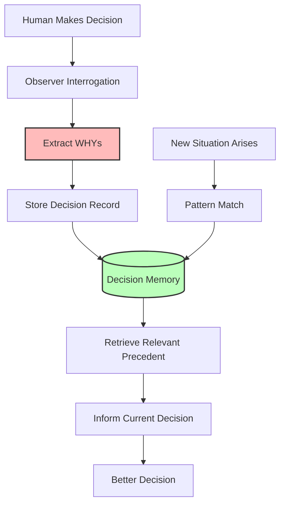
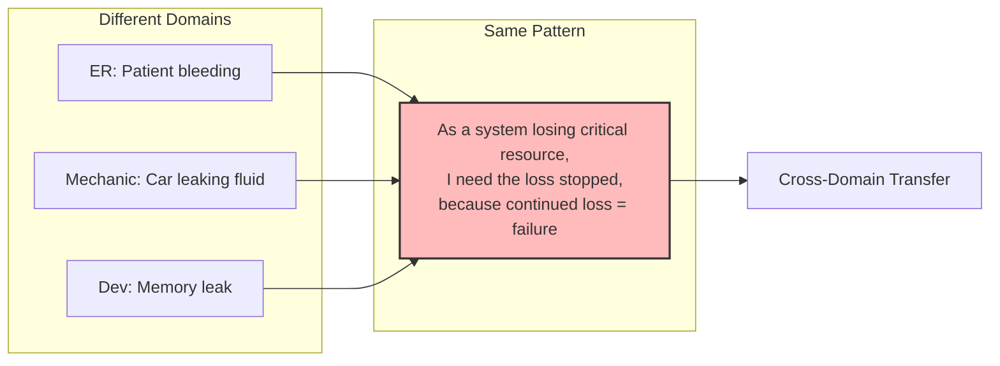
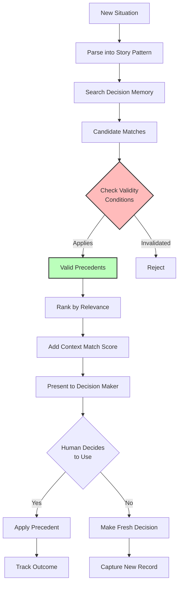
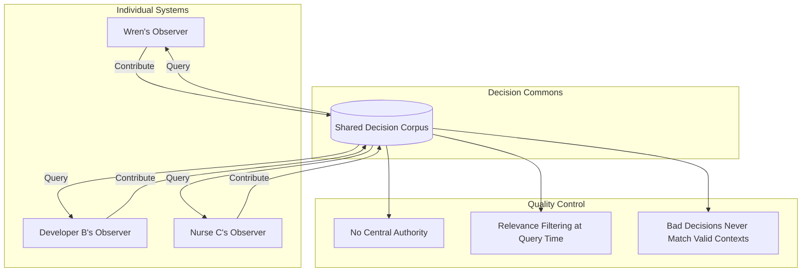

# Observer Framework

> **Post-training learning layer that builds "lived experience" without neural net retraining.**

## Core Innovation

Observer extracts human decision rationale through structured interrogation and stores it as retrievable precedent. This creates a "lived experience" layer that informs future decisions.



---

## Why Observer Exists

### The Gap in Current Approaches

| Approach | Strength | Weakness for Judgment |
|----------|----------|----------------------|
| Fine-tuning | Changes model behavior | Expensive, loses individual context |
| RAG | Great for facts | Terrible for judgment |
| Prompt engineering | Quick to implement | Static, doesn't learn |
| RLHF | Aggregate improvement | Loses individual reasoning |
| In-context learning | Per-session adaptation | Resets every conversation |

### Observer's Differentiators

- **Zero retraining** — Works on top of any LLM
- **Individual, not aggregate** — Your decisions, your context
- **Contextual** — Same fact → different decisions in different situations
- **Transparent** — WHYs in human language, auditable, editable
- **Composable** — Decision patterns can be shared and combined

---

## Decision Record Structure

```yaml
situation_pattern: "As [role], I want [goal], because [motivation]"
context:
  domain: "software_dev" | "life" | "business" | "health" | "relationships"
  # Domain-specific context variables
  stakes: "low" | "medium" | "high" | "critical"
  reversibility: "easily_reversible" | "difficult_to_reverse" | "irreversible"
  time_pressure: "none" | "low" | "moderate" | "urgent"
  
decision: "What was actually chosen"

rejected_alternatives:
  - alternative: "Option that was considered but not chosen"
    why_rejected: "Reason this wasn't selected"

why:
  logical: "Rational justification for the decision"
  experiential: "What past experience informed this"
  emotional: "What felt right or wrong about it"
  values: "How it aligns with TELOS/Substrate"
  
confidence: 1-5  # How confident in this decision

applies_when:
  - "Condition under which this reasoning applies"
  - "Another validity condition"
  
invalidated_by:
  - "Condition that would make this reasoning NOT apply"
  - "Edge case where different logic needed"

# NEW: Environmental Override Section
environmental_override:  # Only present when decision deviates from established pattern
  normal_choice: "What I would typically choose in this situation"
  forcing_condition: "External pressure/constraint that caused deviation"
  condition_type: "deadline" | "legacy_constraint" | "resource_limit" | "dependency" | "political" | "regulatory" | "emergency" | "other"
  actual_choice: "What was chosen instead"
  accepted_tradeoff:
    what: "The cost incurred by this deviation (tech debt, risk, etc.)"
    severity: "minor" | "moderate" | "significant" | "severe"
    reversible: true | false
  revisit_when: "Condition under which we should reconsider and potentially revert"
  debt_registered: true | false  # Flag if this needs active tracking

outcome:  # Filled in later
  result: "What actually happened"
  assessment: "Was this the right call in retrospect?"
  learning: "What would we do differently?"
```

---

## Environmental Override: The Forcing Function

Not all decisions are free choices. Sometimes external conditions **force** a deviation from established patterns.

### Why This Matters

```mermaid
graph TD
    Normal[Normal Pattern<br/>"I always do X"] --> Condition{Environmental<br/>Condition?}
    Condition -->|No| Execute[Execute Normal Pattern]
    Condition -->|Yes| Override[Forced Override]
    Override --> Deviation[Choose Z instead of X]
    Deviation --> Cost[Accept Tradeoff/Debt]
    Cost --> Track[Register for Revisit]
    
    Track --> Future[Future Situation]
    Future --> Check{Condition<br/>Still Present?}
    Check -->|Yes| Continue[Continue Override]
    Check -->|No| Revert[Revert to Normal Pattern]
    
    style Override fill:#f96,stroke:#333,stroke-width:2px
    style Cost fill:#fbb,stroke:#333,stroke-width:2px
```

### Examples

**Software Development:**
> "I normally refactor before adding features, but the client demo deadline in 48 hours forced shipping with tech debt. The debt is moderate (tangled auth flow), reversible, and should be revisited after demo."

```yaml
environmental_override:
  normal_choice: "Refactor auth module before adding SSO"
  forcing_condition: "Client demo deadline in 48 hours"
  condition_type: "deadline"
  actual_choice: "Bolted SSO onto existing auth without cleanup"
  accepted_tradeoff:
    what: "Auth flow now has two paths, increases bug surface"
    severity: "moderate"
    reversible: true
  revisit_when: "After demo, before next sprint"
  debt_registered: true
```

**Infrastructure:**
> "I normally use managed services, but the legacy on-prem requirement forced self-hosted Postgres. Operational burden is significant but contractually required."

```yaml
environmental_override:
  normal_choice: "Use RDS or Cloud SQL"
  forcing_condition: "Client contract requires on-premises data residency"
  condition_type: "regulatory"
  actual_choice: "Self-hosted Postgres on client infrastructure"
  accepted_tradeoff:
    what: "Manual backup management, no auto-scaling, increased ops burden"
    severity: "significant"
    reversible: false  # Contract-locked
  revisit_when: "Contract renewal in 18 months"
  debt_registered: true
```

**Life Decision:**
> "I normally take a week to research major purchases, but the car died and I needed transport for work Monday. Bought first acceptable option."

```yaml
environmental_override:
  normal_choice: "Research 5+ options, compare reviews, negotiate"
  forcing_condition: "Car died Friday, need transport Monday for work"
  condition_type: "emergency"
  actual_choice: "Bought first reliable-looking used car at dealer"
  accepted_tradeoff:
    what: "Possibly overpaid, didn't optimize for features"
    severity: "minor"
    reversible: false  # Can't un-buy
  revisit_when: "N/A - decision complete"
  debt_registered: false
```

### The Debt Registry

When `debt_registered: true`, this decision gets flagged for active tracking:

1. **Periodic Review:** System prompts "Is this override still necessary?"
2. **Condition Monitoring:** If forcing condition changes, alert for potential reversion
3. **Accumulation Warning:** Too many overrides in same area = systemic problem

### Key Distinctions

| Concept | Purpose |
|---------|--------|
| `applies_when` | When this reasoning pattern is valid |
| `invalidated_by` | When this reasoning pattern breaks down |
| `environmental_override` | When external force breaks you OUT of a valid pattern |

The first two are about the **pattern itself**. The third is about **being forced to violate a good pattern** due to circumstances outside your control.

---

## The Story Format Pattern

### Universal Abstraction

The format "As X, I want Y, because Z" strips domain away and exposes underlying structure.



### Example: The Bleeding Patient Pattern

**ER Nurse Decision:**
> "As a system losing critical fluid, I need the leak stopped, because continued loss means total failure."

**Car Mechanic (same pattern):**
> "As a system losing critical fluid, I need the leak stopped, because continued loss means total failure."

**Software Developer (same pattern):**
> "As a system losing memory, I need the leak stopped, because continued loss means crash."

**The insight:** A nurse's decision about prioritizing bleeding patients can inform a developer's decision about prioritizing memory leaks — when the underlying pattern matches.

---

## Interrogation Protocol

When a decision is made, Observer captures it through structured questions:

### Phase 1: Situation Capture
1. What situation did you face?
2. What role were you in?
3. What were the stakes?
4. What time pressure existed?

### Phase 2: Decision Capture
1. What did you decide?
2. What alternatives did you consider?
3. Why did you reject each alternative?

### Phase 3: WHY Extraction
1. What's the logical justification?
2. What past experience informed this?
3. What did your gut say?
4. How does this align with your values/mission?

### Phase 4: Validity Boundaries
1. Under what conditions does this reasoning apply?
2. What would make this reasoning NOT apply?
3. What edge cases exist?

### Phase 5: Confidence Assessment
1. How confident are you (1-5)?
2. What would increase your confidence?
3. What are you uncertain about?

---

## Retrieval Logic

When a new situation arises:



### Validity Checking

A decision record is only surfaced if:
1. Situation pattern matches
2. ALL `applies_when` conditions are met
3. NONE of `invalidated_by` conditions are present
4. Context variables are compatible

---

## Decision Commons Vision

Individual Observer systems can feed a shared corpus:



### Privacy Through Abstraction

Pattern-level decisions are inherently anonymous:
- "As a patient bleeding out..." contains no PII
- Domain expertise transfers without personal data
- Story format IS the privacy layer

### Quality Without Authority

- Zero trust model — decisions accepted unless violate moral principles
- Garbage decisions never match valid contexts (wrong validity conditions)
- Bad WHYs expose themselves when contexts don't transfer
- Wisdom emerges from aggregate, not curation

---

## Integration with Ember

Observer provides the WHAT (precedent, reasoning).
Ember provides the HOW (emotional context, delivery).

Together:
- Observer: "We've faced this before. Here's what we learned."
- Ember: "And given your current state, here's how to engage with it."

---

## Implementation Notes

### Storage
- YAML/JSON files in `~/.claude/history/observer/`
- Indexed by situation pattern
- Tagged by domain and context
- Full-text searchable

### Hooks
- `PostToolUse` hook triggers interrogation for significant decisions
- Lightweight capture for routine choices
- Full interrogation for high-stakes decisions

### Retrieval
- Embedding-based similarity search on situation patterns
- Validity condition filtering
- Context variable matching
- Confidence-weighted ranking

---

## Open Questions

1. **Decay** — Should old decisions lose weight over time?
2. **Conflict Resolution** — When precedents contradict, how to choose?
3. **Outcome Tracking** — How to systematically capture whether decisions were good?
4. **Calibration** — How to adjust confidence based on outcome history?

---

## Next Steps

- [[03-Ember-Framework]] — The emotional intelligence layer
- [[04-PAI-Integration]] — How Observer fits in Miessler's infrastructure
- [[06-Implementation-Plan#Observer Skill|Observer Skill Implementation]]

---

*"Experience is not what happens to you; it's what you do with what happens to you." — Aldous Huxley*
