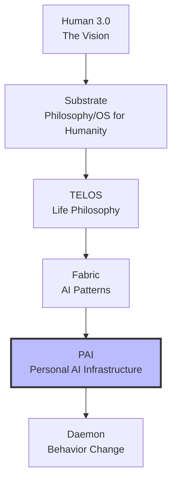
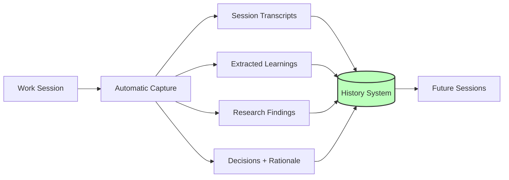
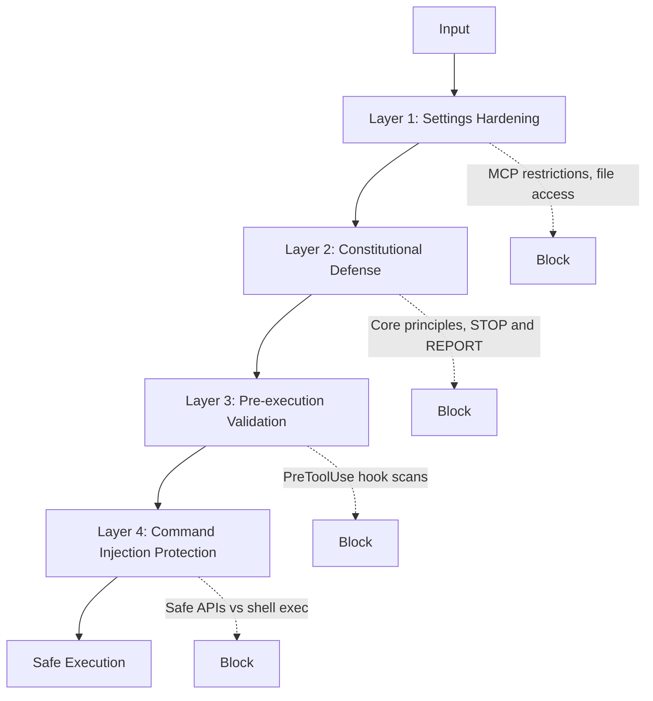
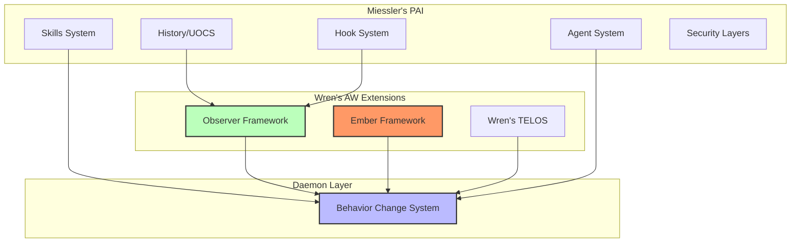

# PAI Integration

> **Daniel Miessler's Personal AI Infrastructure — and how Artificial Wisdom extends it.**

## Miessler's Vision

### Human 3.0
AI-augmented humans navigating post-work world. Not AI replacing humans, but humans with AI becoming capable of more.

### The Stack



| Component | Purpose |
|-----------|---------|
| **Human 3.0** | Vision document for AI-augmented humanity |
| **Substrate** | Philosophy/design document — alternative OS for human organization |
| **TELOS** | Life philosophy: Mission → Goals → Strategy → Tactics (Aristotelian Eudaimonia) |
| **Fabric** | AI utility applying human-written Patterns to inputs (300+ crowdsourced patterns) |
| **Daemon** | System for human behavior change |
| **PAI** | Complete system tying everything together |

---

## PAI v2 Architecture

### AI Maturity Model (AIMM)

| Level | Era | Capabilities | PAI Position |
|-------|-----|--------------|--------------|
| 0 | Pre-2022 | Natural (no AI) | — |
| 1 | 2023-2025 | Chatbots (ChatGPT/Claude chat) | Past |
| 2 | 2025-2027 | Agentic (tools/APIs/actions) | **Current** |
| 3 | 2025-2027 | Workflows (automated pipelines) | Near |
| 4 | 2027+ | Managed (continuous monitoring/optimization) | Future |

PAI v2 operates at **Level 2: Agentic** — Claude Code with tools, APIs, and autonomous action capability.

---

## Core Components

### 1. Skills System

Self-contained packages of domain expertise.

```
skill-name/
├── SKILL.md       # Routing: when to use this skill
├── Workflows/     # Step-by-step procedures
└── Tools/         # CLI scripts, utilities
```

- All Skills pre-loaded into Claude Code system prompt
- 65+ skills in Miessler's system
- Skills ARE the context system (not separate)

**Key insight:** Context management = having the right skills loaded.

### 2. History System (UOCS)

Universal Output Capture System — solves the "re-explaining" problem.



### 3. Hook System

Event-driven automation.

| Hook | Trigger | Use Case |
|------|---------|----------|
| `SessionStart` | New session begins | Load context, announce |
| `PreToolUse` | Before any tool | Security validation |
| `PostToolUse` | After any tool | Capture results |
| `Stop` | Session ends | Save state |
| `SubagentStop` | Worker completes | Collect results |

### 4. Agent System

Specialized personalities with distinct expertise and voices.

**Named Agents:**
- Engineer, Researcher, Artist, etc.
- Fixed personalities and capabilities
- ElevenLabs TTS voices

**Dynamic Agents:**
- Composed on-demand from traits
- "I need someone analytical but creative"
- Swarm pattern for parallel work

### 5. Security System

4-layer defense:



### 6. CLI Infrastructure

`kai` command wraps Claude Code with:
- Voice interface (ElevenLabs)
- Context management
- History integration
- Agent orchestration

---

## Core Principles

Miessler's 15 principles for PAI:

1. **Foundational Algorithm:** Current State → Desired State via verifiable iteration
2. **Clear Thinking + Prompting is King**
3. **Scaffolding > Model** — System architecture matters more than model intelligence
4. **As Deterministic as Possible**
5. **Code Before Prompts**
6. **Spec / Test / Evals First**
7. **UNIX Philosophy** — Modular tooling
8. **ENG / SRE Principles**
9. **CLI as Interface**
10. **Goal → Code → CLI → Prompts → Agents** — Decision hierarchy
11. **Meta / Self Update System**
12. **Custom Skill Management**
13. **Custom History System**
14. **Custom Agent Personalities / Voices**
15. **Science as Cognitive Loop**

---

## How AW Extends PAI

### The Integration



### Mapping AW to PAI

| PAI Component | AW Extension |
|---------------|--------------|
| Skills | + Ember Skill (emotional intelligence) |
| Skills | + Observer Skill (decision interrogation) |
| History/UOCS | + Observer decision records (WHYs extracted) |
| Hooks | + PostToolUse → Observer capture |
| Agents | + Ember-informed personality layer |
| Security | (Use as-is) |
| TELOS | + Wren's personal mission document |
| Substrate | + Wren's additional principles |

### What Miessler Provides (Use)

- PAI directory structure (`~/.claude/`)
- Fabric patterns (300+ crowdsourced)
- Security 4-layer approach
- Hook system patterns
- CLI wrapper concept
- UOCS capture system

### What Wren Builds (Extend)

- **Observer Skill** — Decision interrogation and memory
- **Ember Skill** — Emotional intelligence layer
- **TELOS Document** — Personal life mission
- **Domain Skills** — BMAD, FractionalCTO, Content, SoulProps
- **Listener** — Slack + HTTP orchestration
- **WHY Extraction Hook** — PostToolUse → Observer

---

## Directory Structure

Following Miessler's pattern with AW extensions:

```
~/.claude/
├── context/
│   ├── substrate/           # Philosophy (Miessler's + Wren's)
│   └── telos/               # Wren's life mission
│
├── daemon/                  # BEHAVIOR CHANGE SYSTEM
│   ├── ember/               # Emotional Intelligence Layer
│   │   ├── core.md
│   │   ├── origin.md
│   │   ├── identity.md
│   │   ├── depth-framing.md
│   │   └── ecsl-state.yaml
│   ├── observer/            # Decision Memory Layer
│   │   ├── framework.md
│   │   ├── interrogation-protocol.md
│   │   ├── decision-schema.yaml
│   │   └── validity-logic.md
│   └── integration/         # How they work together
│       ├── routing.md
│       └── aw-principles.md
│
├── skills/                  # Domain expertise
│   ├── bmad/                # Wren's methodology
│   ├── fractional-cto/      # Consulting practice
│   ├── content/             # LinkedIn, newsletter
│   └── soulprops/           # Jordan partnership
│
├── agents/                  # Personalities
├── hooks/                   # Event automation
│
├── history/                 # UOCS + Observer
│   ├── transcripts/         # Session logs
│   ├── learnings/           # Extracted insights
│   └── decisions/           # Observer records
│
└── security/                # Defense layers
```

---

## Build vs Use Decision Matrix

| Component | Action | Notes |
|-----------|--------|-------|
| Fabric | **Use** | Install from GitHub, add custom patterns |
| PAI structure | **Use** | Follow Miessler's ~/.claude/ pattern |
| Skills | **Build** | Wren's domain expertise |
| Hooks | **Build** | Follow patterns, add Observer hooks |
| Agents | **Build** | Wren's personalities + Ember layer |
| History/UOCS | **Use + Extend** | Miessler's capture + Observer WHY extraction |
| Security | **Use** | Miessler's 4-layer approach |
| CLI | **Build** | Listener (Slack + HTTP) |
| TELOS | **Build** | Wren's life mission document |
| Substrate | **Use + Extend** | Miessler's foundation + Wren's principles |
| Observer | **Build** | Wren's contribution |
| Ember | **Build** | Already defined, integrate into PAI |

---

## Key Insight

Miessler built the **infrastructure**. AW adds the **wisdom layer**.

PAI provides:
- Skills (what to do)
- History (what happened)
- Agents (who does it)
- Security (safely)

AW adds:
- Observer (why we decided)
- Ember (how we engage)
- Integration (wise behavior change)

Together: A personal AI system that doesn't just act, but acts **wisely**.

---

## Resources

- [PAI Blog Post](https://danielmiessler.com/blog/personal-ai-infrastructure)
- [Fabric GitHub](https://github.com/danielmiessler/Fabric)
- [TELOS Philosophy](https://danielmiessler.com/p/telos)
- [Substrate](https://danielmiessler.com/p/substrate)

---

## Next Steps

- [[05-Multi-Agent-Architecture]] — The Brain + Workers model
- [[06-Implementation-Plan]] — Build order and timeline

---

*"Scaffolding > Model" — The system architecture matters more than the model intelligence.*
