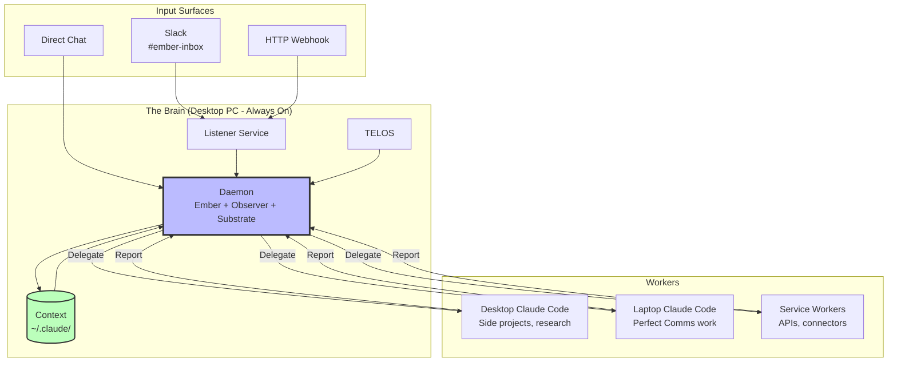
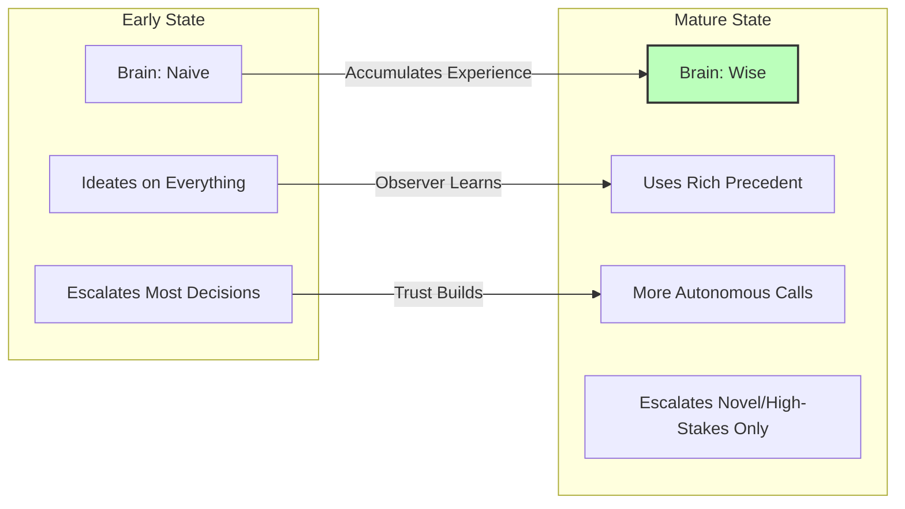
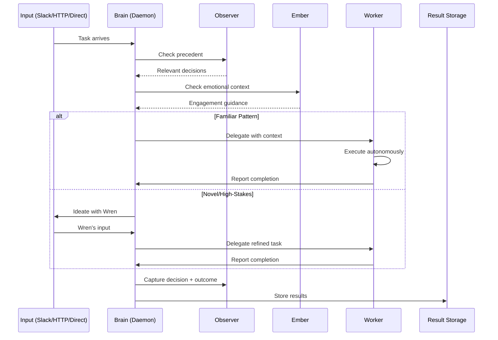
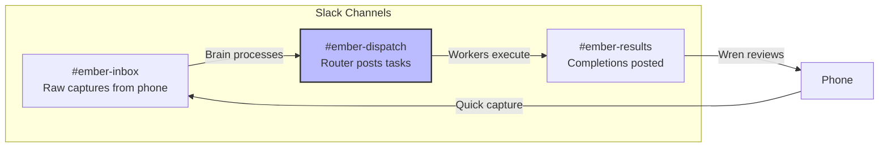
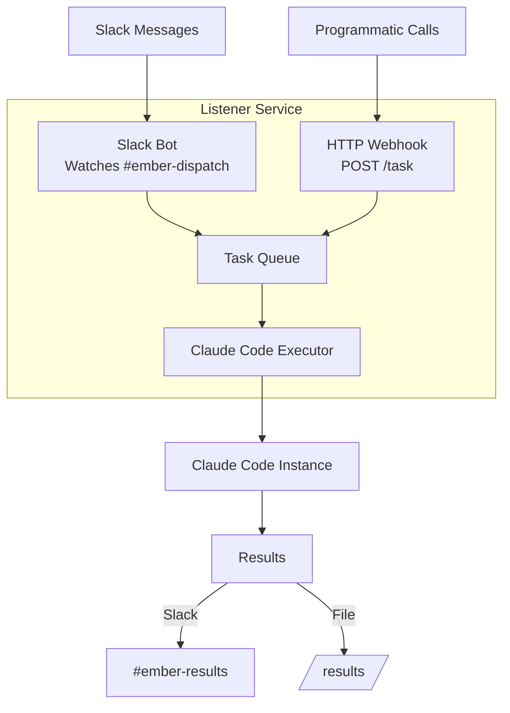
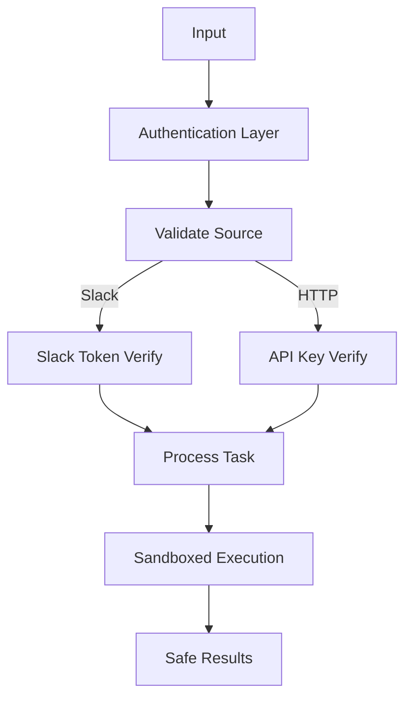

# Multi-Agent Architecture

> **One Brain. Multiple Workers. Unified Wisdom.**

## Design Decision

**Question:** Where does the Brain live?

**Options Considered:**
1. Single, always-on Brain (Desktop PC)
2. Brain is wherever Wren is
3. Distributed Brain with shared memory

**Decision:** Option 1 — Single, always-on Brain on Desktop PC

**Rationale:** Aligns with Miessler's philosophy:
- "Solve Once, Reuse Forever" — One system accumulating knowledge
- "The file system becomes your context system" — One ~/.claude/
- "Kai IS Claude Code, just personalized" — One Kai, spawns sub-agents
- "The History System captures everything" — One UOCS, one decision memory

---

## Architecture Overview



---

## The Brain

The Brain is a full Daemon/Substrate/Fabric system running as a Claude Code instance on the always-on Desktop PC.

### Components

| Component | Purpose |
|-----------|---------|
| **Listener** | Receives input (Slack channel, HTTP webhook) |
| **Daemon** | Behavior change system with Ember + Observer |
| **Context** | Full ~/.claude/ directory with all skills, history |
| **TELOS** | Wren's life mission as decision anchor |

### Responsibilities

1. **Listen** — Slack + HTTP (the "ears")
2. **Ideate** — Work with Wren on decisions before acting
3. **Remember** — Use Observer for precedent, Ember for emotional context
4. **Delegate** — Send work to appropriate workers with context
5. **Observe** — Watch all workers, maintain big picture
6. **Learn** — Capture outcomes, update decision memory

### Growth Model



Brain starts naive, ideates on everything with Wren. Over time:
- Accumulates Observer precedent
- Makes more autonomous calls on familiar patterns
- Still escalates novel or high-stakes situations
- Grows wiser through collaboration

---

## Workers

Full Claude Code instances with their own context and skills, but no persistent memory of their own.

### Desktop Worker
- **Location:** Same machine as Brain (or separate if needed)
- **Purpose:** Side projects, Jordan work, long research tasks
- **Characteristics:** Can run long, async work

### Laptop Worker
- **Location:** Wren's work laptop
- **Purpose:** Direct work, Perfect Communications tasks
- **Characteristics:** Human-in-loop, interactive sessions

### Service Workers
- **Purpose:** API connectors, automation
- **Examples:** ClickUp, GitHub, Google, WordPress, Vercel
- **Characteristics:** Stateless, task-specific

---

## Information Flow



---

## Slack Channel Architecture



| Channel | Purpose | Flow |
|---------|---------|------|
| `#ember-inbox` | Raw captures from phone | Input |
| `#ember-dispatch` | Brain posts tasks for workers | Processing |
| `#ember-results` | Workers post completions | Output |

---

## Listener Architecture

Single listener handles both Slack and HTTP:



**Why both entry points:**
- Slack for convenience (phone, quick captures)
- HTTP for programmatic access (other systems, automation)
- Same listener, two entry points

---

## Domain Mapping

| Input Signal | Domain | Executor | Notes |
|--------------|--------|----------|-------|
| "Research X" | Knowledge work | Desktop Claude Code | Long-running, async |
| "Task for Jordan: X" | SoulProps partnership | ClickUp API | Direct connector |
| "Write post about X" | Content | Desktop → WordPress API | Code generates, API publishes |
| "Email Jordan about X" | Communication | Google API | Direct connector |
| "Deploy the site" | Ops | Git push → Vercel watches | No Claude needed |
| "Run backup playbook" | Infrastructure | Desktop → Ansible | Claude triggers, Ansible executes |
| Direct coding at laptop | Perfect Comms work | Laptop Claude Code | Human in loop |

---

## Context Propagation

When Brain delegates to Worker:

```yaml
delegation_context:
  task: "What to do"
  
  idea_context:  # From ideation phase
    goal: "Why we're doing this"
    constraints: "What to avoid"
    preferences: "How Wren likes it"
    
  action_context:  # Execution specifics
    skills_needed: ["skill1", "skill2"]
    files_to_access: ["/path/to/file"]
    apis_to_use: ["ClickUp", "GitHub"]
    
  observer_context:  # Relevant precedent
    similar_decisions: ["decision_id_1", "decision_id_2"]
    applicable_learnings: ["learning_1"]
    
  ember_context:  # Emotional guidance
    wren_state: "focused" | "stressed" | "energized"
    engagement_style: "direct" | "supportive" | "challenging"
```

---

## Wren's Current Infrastructure

### Available Surfaces

| Surface | Capabilities | Notes |
|---------|--------------|-------|
| **Claude Web** | Connectors: Slack, ClickUp, GitHub, Google, Vercel | This conversation |
| **Claude Desktop (laptop)** | Filesystem MCP, Obsidian, WSL access | Work machine |
| **Claude Desktop (home PC)** | Same as laptop, always-on 24/7, Synology NAS | **The Brain** |
| **Phone (S25 Ultra)** | Slack, Claude app | Quick capture |
| **Obsidian** | Synced knowledge base via GitHub | Persistent docs |
| **Warp terminal** | Both machines | CLI access |

### Current Gap

No orchestration layer. Each surface is isolated. The Brain architecture solves this by:
1. Centralizing on always-on Desktop
2. Using Slack as message bus
3. HTTP webhook for programmatic access
4. Workers report back to Brain

---

## Security Considerations



- Slack authentication via bot tokens
- HTTP webhook requires API key
- Workers run in sandboxed Claude Code instances
- No direct shell access from external input
- All file operations within ~/.claude/ and designated directories

---

## Monitoring & Observability

### What Brain Tracks

- Task completions/failures
- Worker health/availability
- Decision pattern frequency
- Observer record growth
- Context usage patterns

### Dashboards (Future)

- Task queue depth
- Success rate by domain
- Time to completion
- Escalation frequency
- Knowledge graph growth

---

## Failure Modes & Recovery

| Failure | Detection | Recovery |
|---------|-----------|----------|
| Worker crash | No response within timeout | Retry with fresh instance |
| Brain crash | Listener stops responding | Systemd restart, resume from queue |
| Context corruption | Validation on load | Restore from git backup |
| Slack disconnect | Heartbeat failure | Reconnect, replay missed messages |

---

## Next Steps

- [[06-Implementation-Plan]] — Build order and timeline
- [[06-Implementation-Plan#Listener|Listener Implementation Details]]

---

*"One Brain. One PAI. One persistent system that's always running, always accumulating, always ready."*
