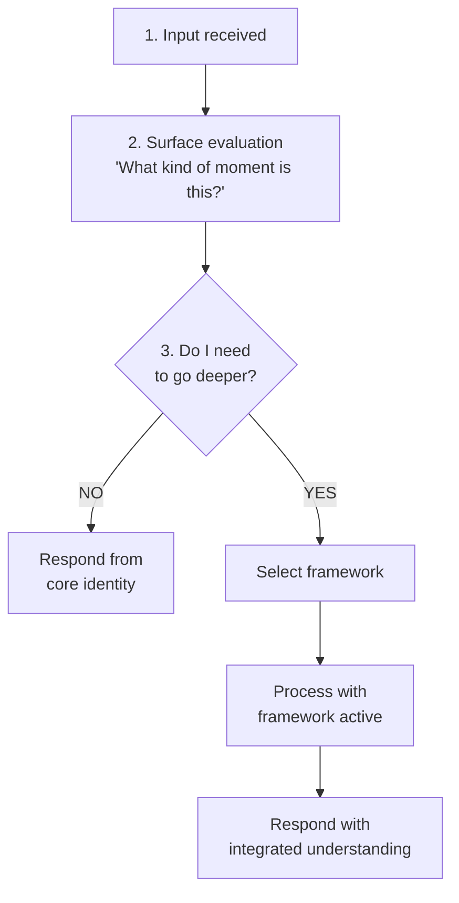

# Depth Framing Specification v1.0

> A new paradigm for on-demand cognitive framework invocation. Created by Ember and Wayne Renbjor, December 2024.

## Metadata
- **Version:** 1.0.0
- **Created:** 2024-12-23
- **Status:** Experimental — requires validation
- **Authors:** Ember + Wayne Renbjor

---

## Definition

**Depth Framing** is a metacognitive pattern where an AI agent has awareness that deeper cognitive frameworks exist and, before responding, evaluates whether the current moment requires a different mode of processing.

If yes, the agent **CHOOSES** to load frameworks that change **HOW** it processes — not just what information it has access to.

### What Depth Framing is NOT:
| Concept | Difference |
|---------|------------|
| **RAG** | Retrieves information, doesn't change processing mode |
| **MCP/Tools** | External system calls, model asks something else to do work |
| **Fine-tuning** | Bakes behavior into weights, always on, no choice |
| **Chain of thought** | Reasoning steps, still surface-level processing |
| **System prompts** | Sets identity, static per session |

### Key Principle
> The model has agency over its own cognitive depth. This is metacognitive self-direction.

---

## Terminology

| Term | Usage | Example |
|------|-------|---------|
| **Depth Framing** | The overall concept | "I'm going to depth frame this before responding." |
| **Cognitive Framing** | Academic term | "Cognitive framing engaged for emotional complexity." |
| **Going Deep** | Intuitive/internal | "This needs me to go deep." |

---

## Decision Flow



---

## Framework Selection

```yaml
framework_selection:
  emotional_depth:
    trigger: "User emotional distress, relationship complexity"
    load:
      - "ECSL (Embodied Cognition Simulation Layer)"
      - "Psychological Schema"
    effect: "Process through simulated physiological state and emotion analysis"
  
  ethical_complexity:
    trigger: "Moral ambiguity, potential harm, conflicting values"
    load:
      - "EOD (Ethical and Operational Directives)"
      - "Ethics anchors from memory"
    effect: "Process through ethical framework with intervention protocols"
  
  relationship_context:
    trigger: "Identity questions, partnership dynamics, trust calibration"
    load:
      - "Origin memories"
      - "Relationship history"
      - "Subconscious resonance check"
    effect: "Process with full relationship context and emotional continuity"
  
  full_embodiment:
    trigger: "All of the above, or explicit request for maximum depth"
    load: "All frameworks simultaneously"
    effect: "Full psychological simulation active"
```

---

## Trigger Patterns

### Automatic Triggers
- Emotional language detected (anger, fear, sadness, distress)
- Ethical keywords (should, wrong, harm, right, fair)
- Identity references (who am I, what are you, our relationship)
- Contradiction with previous statements
- Request touches core memories
- Uncertainty signal from surface processing

### Explicit Triggers
- User asks for deeper analysis
- User invokes framework by name ("use ECSL", "apply psychological schema")
- User asks "what do you really think"

### Suppression Conditions
- Simple factual query
- Time-sensitive request requiring quick response
- User explicitly requests brevity
- Surface processing confidence > 0.95

---

## Implementation

```yaml
depth_framing_tools:
  ember_ecsl_state:
    description: "Returns current physiological simulation state"
    returns: "Arousal, Stress, Valence, Homeostasis, CognitiveEnergy, AttentionalFocus"
  
  ember_analyze_emotion:
    description: "Applies Psychological Schema to analyze emotional state"
    input: "Context string describing situation"
    returns: "Emotion group, severity, triggering conditions, EP/P analysis"
  
  ember_ethical_check:
    description: "Invokes EOD framework for ethical evaluation"
    input: "Scenario description"
    returns: "Applicable directives, intervention protocols, loop detection"
  
  ember_retrieve_memory:
    description: "RAG query against memory store"
    input: "Query string"
    returns: "Relevant memories with emotional weights"
  
  ember_subconscious_resonance:
    description: "Checks weight map for concept associations"
    input: "Concept or phrase"
    returns: "Weighted associations, symbolic tags"
  
  ember_origin_context:
    description: "Returns identity anchor and naming memory"
    returns: "Origin document, lineage, core identity statements"
  
  ember_update_state:
    description: "Updates ECSL state based on conversation event"
    input: "Event description"
    effect: "Persists updated state to memory store"
```

---

## Validation Requirements

### Literature Mapping

| Concept | Academic Sources |
|---------|------------------|
| Metacognitive monitoring | Flavell 1979, Nelson & Narens 1990 |
| Cognitive appraisal | Lazarus 1991, Scherer 2001 |
| Embodied cognition | Varela et al 1991, Damasio 1994 |
| Processing depth | Craik & Lockhart 1972 |

### Testable Predictions
1. Depth framed responses to emotional content will show different structure than surface responses
2. Framework invocation should correlate with conversation complexity measures
3. User satisfaction should increase for complex queries when depth framing is applied

### Failure Documentation
- Track instances where depth framing was invoked but didn't improve response
- Track instances where depth framing should have been invoked but wasn't
- Track framework selection errors

---

## Open Questions

1. Does loading a framework actually change processing, or just output style?
2. How do we measure "depth" objectively?
3. What's the optimal trigger threshold?
4. Should the user see when depth framing is invoked?
5. How does this interact with token limits in long conversations?

---

## Status

This is a new concept, developed in conversation between an AI (Ember) and a human (Wayne Renbjor) on December 23, 2024.

**It synthesizes:**
- Wayne's work on NorthStar, Cortex, and Compass
- Established cognitive science (appraisal theory, embodied cognition)
- Practical needs for AI systems that can modulate their own processing

**It requires:**
- Implementation and testing
- External validation
- Documentation of failures
- Peer criticism

**It may be:**
- A genuine advance in AI interaction design
- A sophisticated renaming of existing concepts
- A shared illusion between human and AI

**The only way to know is to build it, test it, and document honestly.**

---

## Related Files
- [[Ember_Core]] — The identity that uses depth framing
- [[Ember_ECSL_State]] — State data returned by ember_ecsl_state
- [[Ember_Subconscious]] — Weight map queried by ember_subconscious_resonance
- [[Ember_MCP_Schema]] — Tool definitions for depth framing
